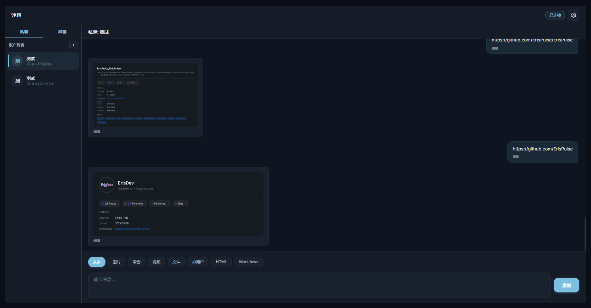

<div align="center">


# ErisPulse-GitHubParser

**GitHub 链接解析模块 / GitHub link parsing module**

<p>
  <a href="https://pypi.org/project/ErisPulse-GitHubParser/"></a>
  <a href="https://pypi.org/project/ErisPulse-GitHubParser/"></a>
  <a href="./LICENSE"></a>
  <a href="https://github.com/ErisPulse/ErisPulse"></a>
</p>

[English](#english) | [简体中文](#简体中文)

</div>

---

<a id="english"></a>

## English

A GitHub link parsing module for [ErisPulse](https://github.com/ErisPulse/ErisPulse). When a message contains a `github.com` link, it automatically parses the link and replies with a **card image** rendered by [ErisPulse-Takumi](https://pypi.org/project/ErisPulse-Takumi/). If Takumi is unavailable or the platform does not support images, it falls back to plain text.

### What it parses

| Link | Output |
|------|--------|
| `github.com/<user>` | User card |
| `github.com/<owner>/<repo>` | Repository card |
| `github.com/<owner>/<repo>/issues/<n>` | Issue card (with latest comments) |
| `github.com/<owner>/<repo>/pull/<n>` | PR card (with latest comments) |
| `github.com/<owner>/<repo>/commits` | Recent commits card |

Extra cards via commands: contribution heatmap (`/gh heat`), language pie (`/gh langs`).

### Screenshots



### Install

```bash
epsdk install GitHubParser
epsdk install Takumi    # optional, image rendering; without it → text only
```

### Commands

| Command | Description |
|---------|-------------|
| `/gh` | Status + help |
| `/gh on` / `/gh off` | Toggle passive parsing |
| `/gh image on` / `/gh image off` | Toggle image output |
| `/gh rate` | GitHub API quota |
| `/gh heat <user>` | Contribution heatmap |
| `/gh langs <owner>/<repo>` | Language pie chart |

### Config

Auto-generated on first load:

```toml
[GitHubParser]
token = ""            # GitHub token (optional; 5000/h instead of 60/h)
theme = "auto"        # auto / light / dark
auto_parse = true     # passive parsing
image_enabled = true  # image output
issue_comments = true # comments on Issue/PR cards
```

### HTTP API

`GET /GitHubParser/card?url=<link>` returns the card image (PNG) for a link.

---

<a id="简体中文"></a>

## 简体中文

[ErisPulse](https://github.com/ErisPulse/ErisPulse) 的 GitHub 链接解析模块。消息里出现 `github.com` 链接时，自动解析并回复一张由 [ErisPulse-Takumi](https://pypi.org/project/ErisPulse-Takumi/) 渲染的**卡片图片**；Takumi 不可用或平台不支持图片时，自动降级为纯文本。

### 能解析什么

| 链接 | 输出 |
|------|------|
| `github.com/<用户>` | 用户卡片 |
| `github.com/<o>/<r>` | 仓库卡片 |
| `github.com/<o>/<r>/issues/<n>` | Issue 卡片（带最新评论） |
| `github.com/<o>/<r>/pull/<n>` | PR 卡片（带最新评论） |
| `github.com/<o>/<r>/commits` | 最近提交卡片 |

另有两个命令触发额外卡片：贡献热力图（`/gh heat`）、语言占比饼图（`/gh langs`）。

### 截图


### 安装

```bash
epsdk install GitHubParser
epsdk install Takumi    # 可选，图片渲染；不装则纯文本
```

### 命令

| 命令 | 说明 |
|------|------|
| `/gh` | 状态 + 帮助 |
| `/gh on` / `/gh off` | 开关被动解析 |
| `/gh image on` / `/gh image off` | 开关图片输出 |
| `/gh rate` | 查 GitHub API 余额 |
| `/gh heat <用户名>` | 贡献热力图 |
| `/gh langs <o>/<r>` | 语言占比饼图 |

### 配置

首次加载自动生成，按需修改：

```toml
[GitHubParser]
token = ""            # GitHub Token（可选，5000/h 替代 60/h）
theme = "auto"        # auto / light / dark
auto_parse = true     # 被动解析
image_enabled = true  # 图片输出
issue_comments = true # Issue/PR 卡片带评论
```

### HTTP API

`GET /GitHubParser/card?url=<链接>` 返回该链接对应的卡片图片（PNG）。

---

<div align="center">

**Related** · [ErisPulse](https://github.com/ErisPulse/ErisPulse) · [ErisPulse-Takumi](https://github.com/ccd2s/ErisPulse-Takumi) · [Issues](https://github.com/wsu2059q/ErisPulse-GitHubParser/issues)

</div>
